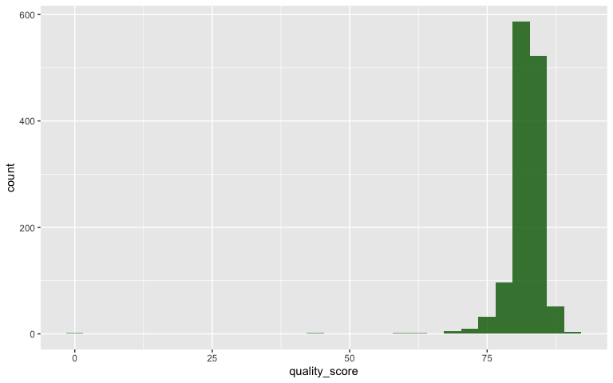
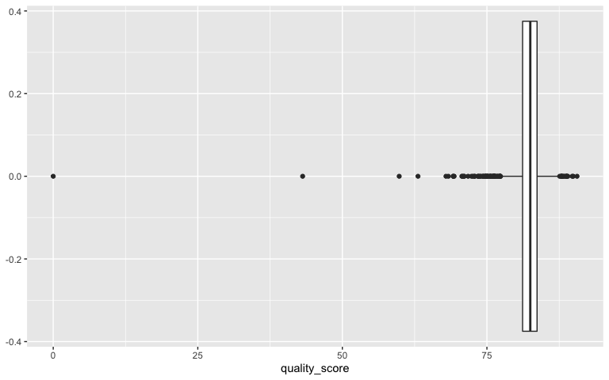
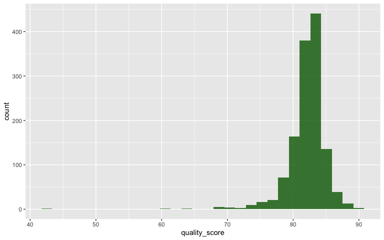
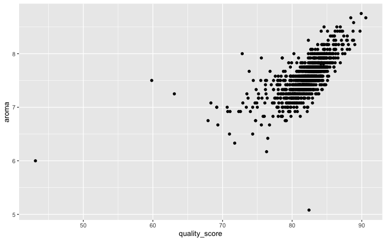
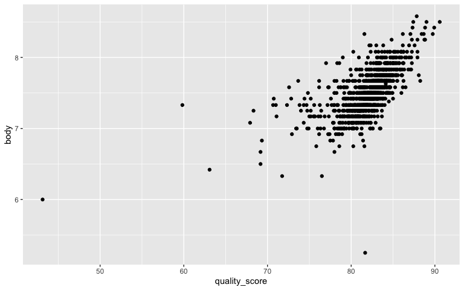
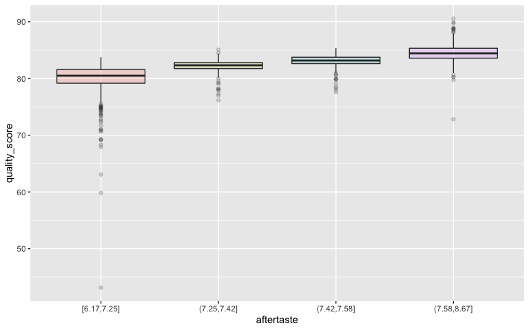
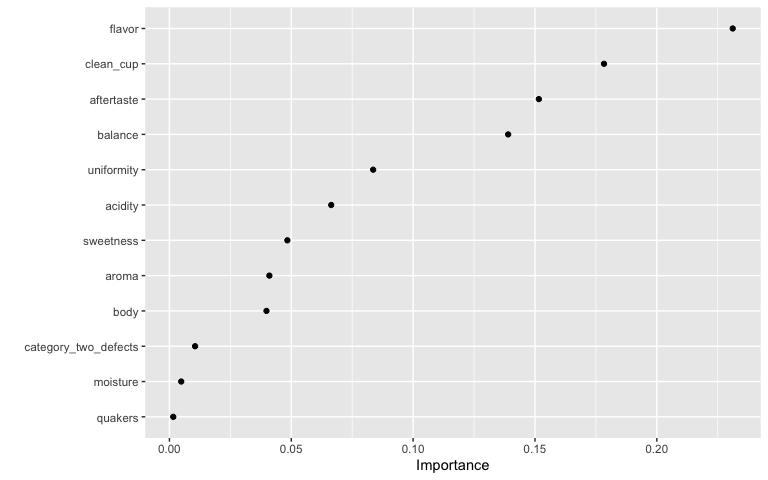

Coffee Analysis
================

I am going to try and fit a model that predicts coffee reviews using a
coffee data set I found. This is a data set from the Coffee Quality
Institute’s webpage, it consists of quality reviews of different brands
of coffee. My goal is to try and come up with a model that will predict
a coffee’s quality score.

``` r
coffee <- read_csv(here::here("Coffee/arabica_ratings_raw.csv"))
```

    ## New names:
    ## * `` -> ...1
    ## * `` -> ...52

    ## Rows: 1312 Columns: 53

    ## ── Column specification ────────────────────────────────────────────────────────
    ## Delimiter: ","
    ## chr (31): Species, Owner, Country of Origin, Farm Name, Lot Number, Mill, IC...
    ## dbl (14): ...1, quality_score, Number of Bags, Aroma, Flavor, Aftertaste, Ac...
    ## lgl  (8): view_certificate_1, view_certificate_2, Cupping Protocol and Descr...

    ## 
    ## ℹ Use `spec()` to retrieve the full column specification for this data.
    ## ℹ Specify the column types or set `show_col_types = FALSE` to quiet this message.

## Data Cleaning

I first need to do a little bit of data cleaning. I want to select the
columns that relate to the coffee quality score and remove any meta data
columns that came with the data. I will also need to make sure that each
of the columns that show the different parts of the review use the same
units of measurement.

``` r
# overview of data set
glimpse(coffee)
```

    ## Rows: 1,312
    ## Columns: 53
    ## $ ...1                               <dbl> 0, 1, 2, 3, 4, 5, 6, 7, 8, 9, 10, 1…
    ## $ quality_score                      <dbl> 90.58, 89.92, 89.75, 89.00, 88.83, …
    ## $ view_certificate_1                 <lgl> NA, NA, NA, NA, NA, NA, NA, NA, NA,…
    ## $ view_certificate_2                 <lgl> NA, NA, NA, NA, NA, NA, NA, NA, NA,…
    ## $ `Cupping Protocol and Descriptors` <lgl> NA, NA, NA, NA, NA, NA, NA, NA, NA,…
    ## $ `View Green Analysis Details`      <lgl> NA, NA, NA, NA, NA, NA, NA, NA, NA,…
    ## $ `Request a Sample`                 <lgl> NA, NA, NA, NA, NA, NA, NA, NA, NA,…
    ## $ Species                            <chr> "Arabica", "Arabica", "Arabica", "A…
    ## $ Owner                              <chr> "metad plc", "metad plc", "Grounds …
    ## $ `Country of Origin`                <chr> "Ethiopia", "Ethiopia", "Guatemala"…
    ## $ `Farm Name`                        <chr> "METAD PLC", "METAD PLC", "San Marc…
    ## $ `Lot Number`                       <chr> NA, NA, NA, NA, NA, NA, NA, NA, NA,…
    ## $ Mill                               <chr> "METAD PLC", "METAD PLC", NA, "Wole…
    ## $ `ICO Number`                       <chr> "2014/2015", "2014/2015", NA, NA, "…
    ## $ Company                            <chr> "METAD Agricultural Developmet plc"…
    ## $ Altitude                           <chr> "1950-2200", "1950-2200", "1600 - 1…
    ## $ Region                             <chr> "GUJI-HAMBELA/GOYO", "GUJI-HAMBELA/…
    ## $ Producer                           <chr> "METAD PLC", "METAD PLC", NA, "Yidn…
    ## $ `Number of Bags`                   <dbl> 300, 300, 5, 320, 300, 100, 100, 30…
    ## $ `Bag Weight`                       <chr> "60 kg", "60 kg", "1", "60 kg", "60…
    ## $ `In-Country Partner`               <chr> "METAD Agricultural Development plc…
    ## $ `Harvest Year`                     <chr> "2014", "2014", NA, "2014", "2014",…
    ## $ `Grading Date`                     <chr> "April 4th, 2015", "April 4th, 2015…
    ## $ Owner.1                            <chr> "metad plc", "metad plc", "Grounds …
    ## $ Variety                            <chr> NA, "Other", "Bourbon", NA, "Other"…
    ## $ Status                             <chr> "Completed", "Completed", "Complete…
    ## $ `Processing Method`                <chr> "Washed / Wet", "Washed / Wet", NA,…
    ## $ `NA`                               <chr> "Sample", "Sample", "Sample", "Samp…
    ## $ Aroma                              <dbl> 8.67, 8.75, 8.42, 8.17, 8.25, 8.58,…
    ## $ Flavor                             <dbl> 8.83, 8.67, 8.50, 8.58, 8.50, 8.42,…
    ## $ Aftertaste                         <dbl> 8.67, 8.50, 8.42, 8.42, 8.25, 8.42,…
    ## $ Acidity                            <dbl> 8.75, 8.58, 8.42, 8.42, 8.50, 8.50,…
    ## $ Body                               <dbl> 8.50, 8.42, 8.33, 8.50, 8.42, 8.25,…
    ## $ Balance                            <dbl> 8.42, 8.42, 8.42, 8.25, 8.33, 8.33,…
    ## $ NA.1                               <chr> "Sample", "Sample", "Sample", "Samp…
    ## $ Uniformity                         <dbl> 10.00, 10.00, 10.00, 10.00, 10.00, …
    ## $ `Clean Cup`                        <dbl> 10, 10, 10, 10, 10, 10, 10, 10, 10,…
    ## $ Sweetness                          <dbl> 10.00, 10.00, 10.00, 10.00, 10.00, …
    ## $ `Cupper Points`                    <dbl> 8.75, 8.58, 9.25, 8.67, 8.58, 8.33,…
    ## $ `Total Cup Points`                 <chr> "Sample  90.58", "Sample  89.92", "…
    ## $ NA.2                               <lgl> NA, NA, NA, NA, NA, NA, NA, NA, NA,…
    ## $ Moisture                           <chr> "12 %", "12 %", "0 %", "11 %", "12 …
    ## $ `Category One Defects`             <chr> "0 full defects", "0 full defects",…
    ## $ Quakers                            <dbl> 0, 0, 0, 0, 0, 0, 0, 0, 0, 0, 0, 0,…
    ## $ Color                              <chr> "Green", "Green", NA, "Green", "Gre…
    ## $ `Category Two Defects`             <chr> "0 full defects", "1 full defects",…
    ## $ NA.3                               <lgl> NA, NA, NA, NA, NA, NA, NA, NA, NA,…
    ## $ Expiration                         <chr> "April 3rd, 2016", "April 3rd, 2016…
    ## $ `Certification Body`               <chr> "METAD Agricultural Development plc…
    ## $ `Certification Address`            <chr> "BAWA Center, 3rd Floor (Gerji), Ad…
    ## $ `Certification Contact`            <chr> "Aman Adinew (Emebet Dinku) - +251-…
    ## $ ...52                              <lgl> NA, NA, NA, NA, NA, NA, NA, NA, NA,…
    ## $ Notes                              <chr> NA, NA, NA, NA, NA, NA, NA, NA, NA,…

``` r
# remove meta data columns
coffee_clean <- coffee %>%
  select(-contains("NA")) %>%
  select("ID" = `...1`, quality_score,
         Aroma, Flavor, Aftertaste, Acidity,
         Body, Balance, Uniformity, `Clean Cup`, 
         Sweetness, Moisture, `Category One Defects`, Quakers,
         Color, `Category Two Defects`) %>%
  distinct()

# quick look to make sure columns are all the right type
glimpse(coffee_clean)
```

    ## Rows: 1,312
    ## Columns: 16
    ## $ ID                     <dbl> 0, 1, 2, 3, 4, 5, 6, 7, 8, 9, 10, 11, 12, 13, 1…
    ## $ quality_score          <dbl> 90.58, 89.92, 89.75, 89.00, 88.83, 88.83, 88.75…
    ## $ Aroma                  <dbl> 8.67, 8.75, 8.42, 8.17, 8.25, 8.58, 8.42, 8.25,…
    ## $ Flavor                 <dbl> 8.83, 8.67, 8.50, 8.58, 8.50, 8.42, 8.50, 8.33,…
    ## $ Aftertaste             <dbl> 8.67, 8.50, 8.42, 8.42, 8.25, 8.42, 8.33, 8.50,…
    ## $ Acidity                <dbl> 8.75, 8.58, 8.42, 8.42, 8.50, 8.50, 8.50, 8.42,…
    ## $ Body                   <dbl> 8.50, 8.42, 8.33, 8.50, 8.42, 8.25, 8.25, 8.33,…
    ## $ Balance                <dbl> 8.42, 8.42, 8.42, 8.25, 8.33, 8.33, 8.25, 8.50,…
    ## $ Uniformity             <dbl> 10.00, 10.00, 10.00, 10.00, 10.00, 10.00, 10.00…
    ## $ `Clean Cup`            <dbl> 10, 10, 10, 10, 10, 10, 10, 10, 10, 10, 10, 10,…
    ## $ Sweetness              <dbl> 10.00, 10.00, 10.00, 10.00, 10.00, 10.00, 10.00…
    ## $ Moisture               <chr> "12 %", "12 %", "0 %", "11 %", "12 %", "11 %", …
    ## $ `Category One Defects` <chr> "0 full defects", "0 full defects", "0 full def…
    ## $ Quakers                <dbl> 0, 0, 0, 0, 0, 0, 0, 0, 0, 0, 0, 0, 0, 0, 0, 0,…
    ## $ Color                  <chr> "Green", "Green", NA, "Green", "Green", "Bluish…
    ## $ `Category Two Defects` <chr> "0 full defects", "1 full defects", "0 full def…

``` r
# convert moisture clean to numeric
coffee_clean <- coffee_clean %>%
  mutate(Moisture = str_extract(Moisture, "[0-9]+"),
         Moisture = as.numeric(Moisture),
         Moisture = Moisture/100)

# make defect columns numeric
coffee_clean <- coffee_clean %>%
  mutate_at(vars(contains("Defects")), list(~str_extract(., "[0-9]+"))) %>%
  mutate_at(vars(contains("Defects")), list(~as.numeric(.)))

# fix column names
coffee_clean <- coffee_clean %>%
  janitor::clean_names()

# check for NAs
nas <- coffee_clean %>%
  filter_all(any_vars(is.na(.)))

# most color NA, will replace with a 'not listed'
# one na in quakers, will remove
coffee_clean <- coffee_clean %>%
  mutate(color = if_else(is.na(color), "Not Listed", color)) %>%
  filter(!is.na(quakers))
```

## Explore data

``` r
# historgram
coffee_clean %>%
  ggplot(aes(quality_score)) + 
  geom_histogram(fill = "darkgreen", alpha = 0.8)
```

    ## `stat_bin()` using `bins = 30`. Pick better value with `binwidth`.

<!-- -->

``` r
# some interesting outliers, better do a boxplot to confirm
coffee_clean %>%
  ggplot(aes(quality_score)) + 
  geom_boxplot()
```

<!-- -->

``` r
# pretty normally distributed data, but there are a few outliers towards the lower end of the data
summary(coffee_clean$quality_score)
```

    ##    Min. 1st Qu.  Median    Mean 3rd Qu.    Max. 
    ##    0.00   81.17   82.50   82.09   83.67   90.58

``` r
# look at those with 0 quality score
# one observation where most columns are just '0'
check_quality <- coffee_clean %>%
  filter(quality_score == 0)

# remove one zero outliers 
# historgram
coffee_clean %>%
  filter(quality_score != 0) %>%
  ggplot(aes(quality_score)) + 
  geom_histogram(fill = "darkgreen", alpha = 0.8)
```

    ## `stat_bin()` using `bins = 30`. Pick better value with `binwidth`.

<!-- -->

``` r
coffee_clean <- coffee_clean %>%
  filter(quality_score != 0)

# some common scatter plots
# pretty decent linear relationship 
coffee_clean %>%
  ggplot(aes(quality_score, aroma)) + 
  geom_point() 
```

<!-- -->

``` r
coffee_clean %>%
  ggplot(aes(quality_score, acidity)) + 
  geom_point()
```

<!-- -->

``` r
coffee_clean %>%
  ggplot(aes(quality_score, body)) + 
  geom_point()
```

<!-- -->

``` r
# a breakdown of quality score by binned aftertaste
coffee_clean %>%
  filter(!is.na(aftertaste)) %>%
  mutate(aftertaste = cut_number(aftertaste, 4)) %>%
  ggplot(aes(aftertaste, quality_score, fill = aftertaste)) +
  geom_boxplot(alpha = 0.2, show.legend = FALSE)
```

<!-- -->

## Build models

``` r
set.seed(123)
coffee_clean <- initial_split(data = coffee_clean, strata = quality_score)
coffee_train <- training(coffee_clean)
coffee_test <- testing(coffee_clean)

set.seed(234)
coffee_folds <- vfold_cv(coffee_train, strata = quality_score)


xgb_spec <-
  boost_tree(
    trees = tune(),
    mtry = tune(),
    min_n = tune(),
    learn_rate = tune(),
    loss_reduction = tune(),
    sample_size = tune()
  ) %>%
  set_engine("xgboost") %>%
  set_mode("regression")

coffee_rec <- 
  recipe(quality_score ~ ., data = coffee_train) %>%
  update_role(id, new_role = "ID") %>%
  step_normalize(all_numeric_predictors()) %>%
  step_zv(all_predictors()) %>%
  step_dummy(all_nominal_predictors()) 


xgb_wf <- workflow(coffee_rec, xgb_spec)

# tune the model
doParallel::registerDoParallel()

set.seed(234)
xgb_coffee_rs <-
  tune_grid(
    xgb_wf,
    coffee_folds,
    grid = 20
  )
```

    ## i Creating pre-processing data to finalize unknown parameter: mtry

## Evaluate models

``` r
show_best(xgb_coffee_rs, metric = "rsq")
```

    ## # A tibble: 5 × 12
    ##    mtry trees min_n learn_rate loss_reduction sample_size .metric .estimator
    ##   <int> <int> <int>      <dbl>          <dbl>       <dbl> <chr>   <chr>     
    ## 1    10  1740    19   0.0351    0.000596            0.652 rsq     standard  
    ## 2     4  1887    38   0.0664    0.000000625         0.745 rsq     standard  
    ## 3     9   699     2   0.00292   0.00000000383       0.400 rsq     standard  
    ## 4     7  1671    25   0.00505   0.0690              0.143 rsq     standard  
    ## 5     8  1983    13   0.000280  0.0000934           0.867 rsq     standard  
    ## # … with 4 more variables: mean <dbl>, n <int>, std_err <dbl>, .config <chr>

``` r
xgb_last <-
  xgb_wf %>%
  finalize_workflow(select_best(xgb_coffee_rs, "rsq")) %>%
  last_fit(coffee_clean)

library(vip)
```

    ## 
    ## Attaching package: 'vip'

    ## The following object is masked from 'package:utils':
    ## 
    ##     vi

``` r
xgb_fit <- extract_fit_parsnip(xgb_last)
vip(xgb_fit, geom = "point", num_features = 12)
```

<!-- -->

It seems that the most important variables in the quality score are
flavor, clean\_cup and aftertaste.
