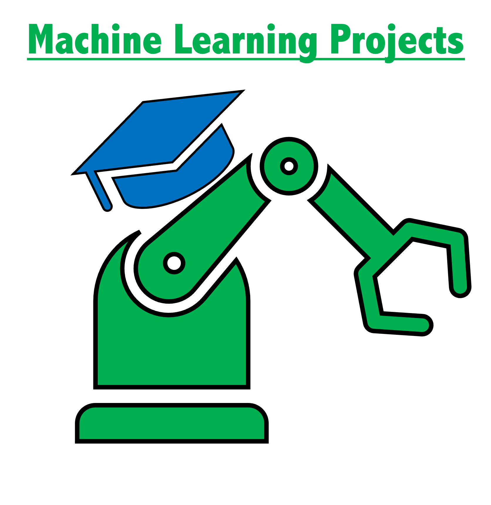

README
================

## Overview

This is a fun project where I plan to store any kind of fun data science
projects. I really just want to use the data sets to enhance my machine
learning and visualization skills. This will always be a work in
progress with new data and code being constantly added.

## Table Of Contents

-   Coffee: data pulled from
    [jldbc-github](https://github.com/jldbc/coffee-quality-database).
    This is web scraped data from the Coffee Quality Institute’s
    webpage. The data consists of different coffee bean reviews. In this
    project, I will build a model that is able to predict a coffee
    bean’s quality.

-   Marvel: data pulled from FiveThirtyEight’s github page. The goal of
    this project is to try and come up with a model that will predict if
    a Marvel characters is good, bad, or neutral based on physical
    characteristics and meta data.
