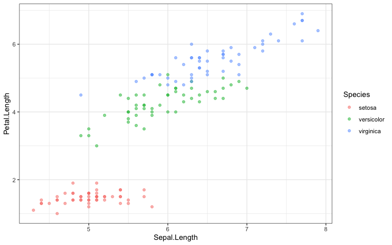

Just some fun
================
2022-05-07

Going to be playing with the standard iris data

``` r
data(iris)
glimpse(iris)
```

    ## Rows: 150
    ## Columns: 5
    ## $ Sepal.Length <dbl> 5.1, 4.9, 4.7, 4.6, 5.0, 5.4, 4.6, 5.0, 4.4, 4.9, 5.4, 4.…
    ## $ Sepal.Width  <dbl> 3.5, 3.0, 3.2, 3.1, 3.6, 3.9, 3.4, 3.4, 2.9, 3.1, 3.7, 3.…
    ## $ Petal.Length <dbl> 1.4, 1.4, 1.3, 1.5, 1.4, 1.7, 1.4, 1.5, 1.4, 1.5, 1.5, 1.…
    ## $ Petal.Width  <dbl> 0.2, 0.2, 0.2, 0.2, 0.2, 0.4, 0.3, 0.2, 0.2, 0.1, 0.2, 0.…
    ## $ Species      <fct> setosa, setosa, setosa, setosa, setosa, setosa, setosa, s…

## Explore data

``` r
iris %>%
  ggplot(aes(Sepal.Length, Petal.Length, color = Species)) +
  geom_point(alpha = 0.5) +
  theme_bw()
```

<!-- -->

## Build models

``` r
set.seed(123)
iris_split <- initial_split(iris, strata = Species)
iris_train <- training(iris_split)
iris_test <- testing(iris_split)

set.seed(234)
iris_folds <- vfold_cv(iris_train, strata = Species)
iris_folds
```

    ## #  10-fold cross-validation using stratification 
    ## # A tibble: 10 × 2
    ##    splits          id    
    ##    <list>          <chr> 
    ##  1 <split [99/12]> Fold01
    ##  2 <split [99/12]> Fold02
    ##  3 <split [99/12]> Fold03
    ##  4 <split [99/12]> Fold04
    ##  5 <split [99/12]> Fold05
    ##  6 <split [99/12]> Fold06
    ##  7 <split [99/12]> Fold07
    ##  8 <split [102/9]> Fold08
    ##  9 <split [102/9]> Fold09
    ## 10 <split [102/9]> Fold10

# Multinomial regression versus random forest

``` r
lr_mod <- 
  multinom_reg(penalty = tune(), mixture = 1) %>% 
  set_engine("glmnet")


lr_recipe <- 
  recipe(Species ~ ., data = iris_train) %>% 
  step_zv(all_predictors()) %>% 
  step_normalize(all_predictors())

lr_workflow <- 
  workflow() %>% 
  add_model(lr_mod) %>% 
  add_recipe(lr_recipe)

lr_reg_grid <- tibble(penalty = 10^seq(-4, -1, length.out = 30))

lr_res <- 
  lr_workflow %>% 
  tune_grid(iris_folds,
            grid = lr_reg_grid,
            control = control_grid(save_pred = TRUE),
            metrics = metric_set(roc_auc))
```

    ## Warning: package 'glmnet' was built under R version 4.1.2

``` r
  lr_res %>% 
    show_best(metric = "roc_auc")
```

    ## # A tibble: 5 × 7
    ##    penalty .metric .estimator  mean     n std_err .config              
    ##      <dbl> <chr>   <chr>      <dbl> <int>   <dbl> <chr>                
    ## 1 0.000161 roc_auc hand_till      1    10       0 Preprocessor1_Model03
    ## 2 0.000204 roc_auc hand_till      1    10       0 Preprocessor1_Model04
    ## 3 0.000259 roc_auc hand_till      1    10       0 Preprocessor1_Model05
    ## 4 0.000329 roc_auc hand_till      1    10       0 Preprocessor1_Model06
    ## 5 0.000418 roc_auc hand_till      1    10       0 Preprocessor1_Model07

``` r
cores <- parallel::detectCores()
rf_mod <- 
  rand_forest(mtry = tune(), min_n = tune(), trees = 1000) %>% 
  set_engine("ranger", num.threads = cores) %>% 
  set_mode("classification")

rf_recipe <- 
  recipe(Species ~ ., data = iris_train)

rf_workflow <- 
  workflow() %>% 
  add_model(rf_mod) %>% 
  add_recipe(rf_recipe)

set.seed(345)
rf_res <- 
  rf_workflow %>% 
  tune_grid(iris_folds,
            grid = 25,
            control = control_grid(save_pred = TRUE),
            metrics = metric_set(roc_auc))
```

    ## i Creating pre-processing data to finalize unknown parameter: mtry

``` r
rf_res %>% 
  show_best(metric = "roc_auc")
```

    ## # A tibble: 5 × 8
    ##    mtry min_n .metric .estimator  mean     n std_err .config              
    ##   <int> <int> <chr>   <chr>      <dbl> <int>   <dbl> <chr>                
    ## 1     3    36 roc_auc hand_till  0.985    10  0.0114 Preprocessor1_Model16
    ## 2     3    39 roc_auc hand_till  0.985    10  0.0114 Preprocessor1_Model21
    ## 3     2    26 roc_auc hand_till  0.984    10  0.0113 Preprocessor1_Model15
    ## 4     2     7 roc_auc hand_till  0.983    10  0.0113 Preprocessor1_Model01
    ## 5     4    30 roc_auc hand_till  0.983    10  0.0113 Preprocessor1_Model02

## Evaluate models

``` r
lr_best <- lr_res %>%
  select_best(metric = "roc_auc")

rf_best <- rf_res %>%
  select_best(metric = "roc_auc")
```

## Fit Final Model

``` r
final_wf <- 
  lr_workflow %>% 
  finalize_workflow(lr_best)


final_fit <- 
  final_wf %>%
  last_fit(iris_split) 

final_fit %>%
  collect_metrics()
```

    ## # A tibble: 2 × 4
    ##   .metric  .estimator .estimate .config             
    ##   <chr>    <chr>          <dbl> <chr>               
    ## 1 accuracy multiclass     0.974 Preprocessor1_Model1
    ## 2 roc_auc  hand_till      1     Preprocessor1_Model1

``` r
final_fit %>%
  collect_predictions() %>%
  conf_mat(Species, .pred_class)
```

    ##             Truth
    ## Prediction   setosa versicolor virginica
    ##   setosa         13          0         0
    ##   versicolor      0         13         1
    ##   virginica       0          0        12
